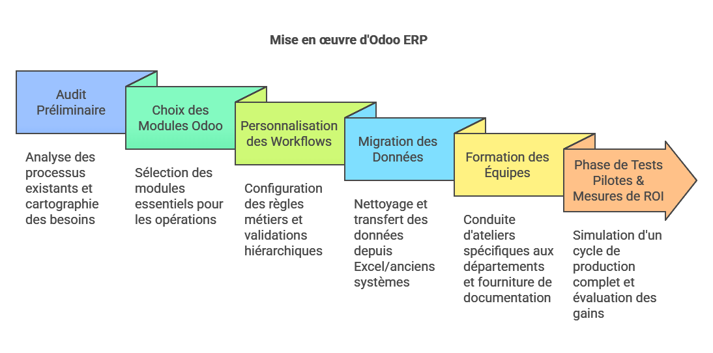
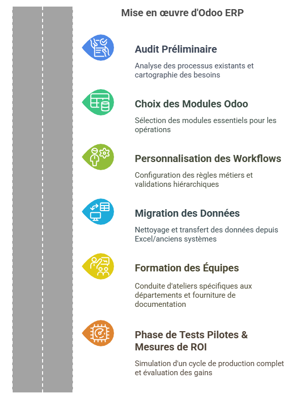

L'implémentation d’un ERP est une démarche stratégique pour moderniser la gestion d’une entreprise industrielle. Dans le secteur de la métallurgie, les défis sont nombreux : gestion de la production complexe, suivi précis des coûts, respect des réglementations sociales et bien d’autres enjeux. Cet article détaillé vous guide, étape par étape, dans l’implémentation d’un ERP Odoo pour une PME de fabrication métallique, en s’appuyant sur l’exemple fictif mais réaliste de l’entreprise MetalPro.

## Contexte et Enjeux de la Métallurgie

Les entreprises métallurgiques font face à des problématiques spécifiques, telles que :

- **Gestion de production complexe** : Coordination entre les différents ateliers, suivi des phases de fabrication, planification des interventions techniques.
- **Suivi des coûts** : Analyse des coûts de matière première, gestion des dépenses énergétiques et maintenance des machines.
- **Réglementation sociale et administrative** : Gestion de la paie (bulletins de salaire, congés, déclarations sociales), respect des conventions collectives, audits réguliers.
- **Ventes B2B** : Processus de devis, facturation, gestion des stocks et relation clients souvent personnalisée.
Pour **MetalPro**, une PME de 50 salariés spécialisée dans la fabrication métallique, l’ERP Odoo se présente comme un outil central pour répondre à ces enjeux et améliorer la performance globale de l’entreprise.

## Étude de Cas : MetalPro
**MetalPro** doit gérer plusieurs domaines d'activité :

- **Paie et Ressources Humaines** : Production de bulletins de salaire, gestion des congés, déclarations sociales.
- **Comptabilité Analytique** : Suivi des coûts de matière première, analyse de la rentabilité par produit et par atelier.
- **Ventes B2B** : Création de devis, émission de factures, gestion des stocks et suivi des expéditions.
Cette situation complexe nécessite une solution ERP modulable et adaptée, telle que Odoo, qui permet une intégration fluide de plusieurs fonctions métiers.

## Les 6 Étapes Clés pour une Implémentation Réussie
### 1. Audit Préliminaire : Cartographie des Processus Métier
Avant toute implémentation, il est essentiel de réaliser un audit complet :

- **Analyse des processus actuels** : Identifier les flux de travail dans la production, la paie, la comptabilité et les ventes.
- **Cartographie des besoins** : Dresser un état des lieux des outils utilisés (Excel, logiciels obsolètes, etc.).
- **Identification des points d’amélioration** : Dégager les goulots d’étranglement et les tâches chronophages.
*Conseil pratique* : Impliquez les responsables de chaque département pour une vision complète et objective.

### 2. Choix des Modules Odoo
La richesse d’Odoo réside dans la diversité de ses modules. Pour MetalPro, les modules suivants seront indispensables :

- **Fabrication** : Pour gérer les ordres de fabrication, la planification des opérations et le suivi de la production.
HR Payroll : Pour automatiser la gestion de la paie, des congés et des déclarations sociales.
Accounting : Pour une comptabilité analytique fine et un suivi précis des coûts.
Sales : Pour la création de devis, la facturation et la gestion des stocks.
Modules complémentaires : Gestion de projet, CRM et autres selon les spécificités de l’entreprise.
Conseil pratique : Priorisez les modules en fonction des processus critiques identifiés lors de l’audit.

3. Personnalisation des Workflows
Chaque entreprise a ses spécificités. Chez MetalPro, par exemple, un devis supérieur à 10 000€ doit bénéficier d’une validation hiérarchique :

Définition des règles métiers : Déterminer les seuils et les procédures spécifiques (exemple : validation automatique pour les devis inférieurs à 10k€).
Configuration des workflows : Adapter les processus dans Odoo pour qu’ils correspondent aux règles internes.
Tests de validation : Vérifier que les personnalisations répondent aux exigences opérationnelles.
Conseil pratique : Documentez précisément chaque règle et assurez-vous que tous les acteurs impliqués sont informés des changements.

4. Migration des Données
La transition depuis des outils traditionnels (Excel, anciens logiciels) vers Odoo nécessite une préparation rigoureuse :

Audit des données existantes : Vérifier la qualité et la cohérence des données.
Planification de la migration : Définir un calendrier et les étapes de transfert.
Nettoyage et normalisation : Éliminer les doublons et corriger les incohérences pour éviter des erreurs post-migration.
Conseil pratique : Ne sous-estimez pas la phase de nettoyage des données. Une migration bien préparée réduit considérablement les risques d’erreurs.

5. Formation des Équipes
L’adoption d’un nouvel outil dépend en grande partie de la formation des utilisateurs :

Ateliers métier différenciés : Organiser des sessions spécifiques pour les comptables, les opérateurs de production et les équipes commerciales.
Documentation et supports : Fournir des guides utilisateurs, des FAQ internes et des tutoriels.
Accompagnement post-implémentation : Mettre en place une assistance technique et fonctionnelle pour répondre aux questions au quotidien.
Conseil pratique : Impliquez les équipes dès le début pour faciliter l’adhésion au changement et réduire les résistances.

6. Phase de Tests Pilotes et Mesures de ROI
Avant le déploiement complet, une phase de tests pilotes est indispensable :

Simulation d’un cycle de production complet : Tester l’ensemble des processus, de la saisie d’un devis jusqu’à la production et la facturation.
Recueil des retours utilisateurs : Identifier les ajustements nécessaires.
Mesure du ROI : Par exemple, MetalPro a pu constater une réduction de 30 % du temps de traitement de la paie dès le premier trimestre après implémentation.
Conseil pratique : Établissez des indicateurs clés de performance (KPI) pour suivre l’efficacité et l’impact de l’ERP sur votre activité.

```
Mois 1 : Audit Préliminaire
   - Analyse des processus existants
   - Cartographie des besoins

Mois 2 : Choix des Modules Odoo
   - Sélection des modules essentiels (Manufacturing, HR Payroll, Accounting, Sales)

Mois 3 : Personnalisation des Workflows
   - Configuration des règles métiers (ex : devis > 10k€)
   - Mise en place des validations hiérarchiques

Mois 4 : Migration des Données
   - Nettoyage des données existantes
   - Transfert depuis Excel/ancien logiciel

Mois 5 : Formation des Équipes
   - Ateliers spécifiques pour chaque département
   - Support et documentation utilisateur

Mois 6 : Phase de Tests Pilotes & Mesures de ROI
   - Simulation d’un cycle de production complet
   - Évaluation et ajustements finaux (ex : 30 % de gain sur la paie)
   ```
Conseils Pratiques et Meilleures Astuces
Éviter les erreurs courantes :

Ne pas négliger la phase de nettoyage des données.
S’assurer de la cohérence des informations migrées.
Prendre le temps de personnaliser les workflows selon vos besoins réels.
Critères pour choisir un partenaire Odoo certifié :

Expérience avérée dans le secteur industriel et de la métallurgie.
Références et retours d’expérience d’entreprises similaires.
Capacité à fournir un support complet (formation, maintenance, évolutions).
Stratégie de gestion du changement :

Impliquez les opérationnels dès la phase de conception pour favoriser l’adhésion.
Communiquez régulièrement sur les avancées du projet.
Préparez des sessions de feedback pour ajuster les processus en continu.
FAQ
Odoo peut-il gérer les conventions collectives de la métallurgie ?
Oui, Odoo est suffisamment flexible pour intégrer les spécificités des conventions collectives de la métallurgie. Grâce à la personnalisation des modules RH et paie, il est possible d’adapter les règles de rémunération, de gestion des congés et des heures supplémentaires aux exigences réglementaires du secteur.

Quel budget prévoir pour une entreprise de 50 salariés ?
Le budget dépend de plusieurs facteurs, dont la complexité des processus, le niveau de personnalisation et l’accompagnement par un partenaire certifié. Pour une PME de 50 salariés comme MetalPro, on peut estimer un budget global (logiciel, formation, support et migration) entre 30 000 et 60 000 euros. Il est toutefois recommandé de réaliser une étude préalable pour affiner cette estimation en fonction de vos besoins spécifiques.

Conclusion
L’implémentation d’un ERP Odoo représente une opportunité majeure pour les entreprises de la métallurgie souhaitant optimiser leurs processus, réduire les coûts et améliorer la productivité. En suivant ces six étapes clés, en prenant soin de bien préparer chaque phase et en impliquant l’ensemble des équipes, MetalPro – et par extension, votre entreprise – pourra tirer pleinement profit des atouts offerts par Odoo.

N’hésitez pas à consulter des experts et partenaires certifiés pour un accompagnement sur-mesure, afin de transformer cette transition en une véritable réussite opérationnelle et stratégique.


