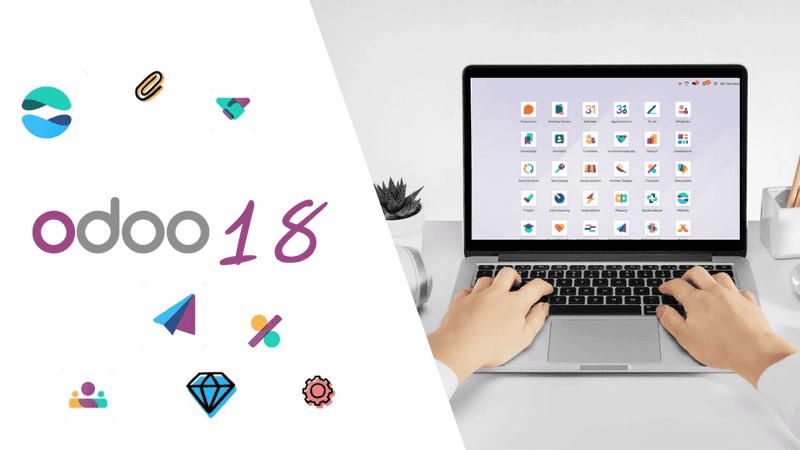

## Introduction

Odoo continue d’évoluer et la version Odoo 18 apporte son lot d’améliorations et de nouvelles fonctionnalités. Que vous soyez un intégrateur, un développeur ou un utilisateur final, cette mise à jour introduit des améliorations majeures en termes de performance, automatisation et expérience utilisateur.

Dans cet article, nous allons explorer les nouveautés les plus marquantes d’Odoo 18 et comment elles peuvent impacter votre entreprise.

## 1. Interface utilisateur repensée : Plus rapide et plus intuitive

Odoo 18 améliore considérablement l’expérience utilisateur avec :  
✔️ Une interface modernisée : un design plus épuré, optimisé pour une meilleure lisibilité.  
✔️ Mode sombre natif : amélioration du confort visuel pour les utilisateurs.  
✔️ Optimisation mobile : meilleure réactivité et performances accrues sur les smartphones et tablettes.  

🔍 Mon avis d’expert : Ces améliorations facilitent la prise en main et offrent une navigation plus fluide, particulièrement pour les nouveaux utilisateurs.

## 2. Automatisation et intelligence artificielle au cœur d’Odoo 18

Odoo intègre davantage d’IA et d’automatisation, notamment :  

🧠 Assistant IA pour les tâches répétitives : recommandations intelligentes pour automatiser les processus.  
🤖 Génération automatique de factures : reconnaissance des documents améliorée grâce au machine learning.  
🏢 Automatisation des processus RH : suivi intelligent des candidatures et gestion des absences optimisée.  
📌 Impact sur votre entreprise : Moins de tâches manuelles, plus d’efficacité et une gestion plus rapide des workflows.  

## 3. Amélioration de la gestion comptable et financière
Odoo 18 apporte de nombreuses améliorations pour les entreprises : 📊 Nouvelle interface comptable pour une meilleure visibilité des finances.  
💳 Intégration améliorée avec les banques pour un rapprochement bancaire plus rapide.  
🔄 Gestion multi-devises optimisée avec des mises à jour automatiques du taux de change.  

🚀 Bon à savoir : Ces fonctionnalités réduisent considérablement le temps de gestion comptable, un atout majeur pour les PME.  

## 4. Un CRM encore plus puissant pour booster vos ventes

Le module CRM a été enrichi pour offrir :  

📌 Un pipeline de vente dynamique avec des prévisions plus précises.  
🔗 Une intégration plus fluide avec WhatsApp et Telegram pour la gestion des leads.  
📧 Automatisation des campagnes marketing avec des scénarios avancés.  
💡 Astuce : Avec ces évolutions, il devient encore plus simple d’améliorer son taux de conversion et de suivre ses prospects efficacement.  

## 5. Nouveautés pour les développeurs et intégrateurs

Pour les experts techniques, Odoo 18 introduit :  

⚙️ Amélioration du framework OWL : plus rapide et plus modulaire.  
🔄 API REST plus robuste pour une meilleure intégration avec d’autres outils.  
🚀 Refonte du moteur de reporting pour des rapports plus personnalisables et performants.  
📌 Mon avis d’intégrateur Odoo : Ces mises à jour facilitent le développement de nouvelles applications et simplifient l’intégration avec d’autres systèmes.  

## Conclusion : Pourquoi adopter Odoo 18 ?

Avec Odoo 18, nous avons une version plus rapide, intelligente et intuitive. Que ce soit pour les entreprises, les intégrateurs ou les développeurs, cette mise à jour apporte un gain de productivité significatif.  

Vous voulez migrer vers Odoo 18 ou en savoir plus ? Contactez-moi pour une consultation personnalisée ! 🚀  