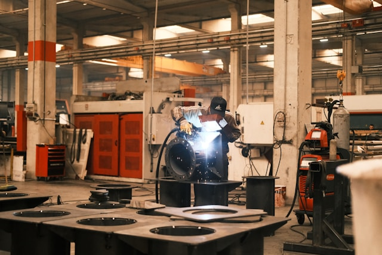

Lorsqu’il est question d’optimiser les opérations et d’accroître la compétitivité, l’implémentation d’un système ERP (Enterprise Resource Planning) se présente souvent comme la solution incontournable. Pour les entreprises de fabrication au Québec, l’ERP permet de centraliser l’information, d’automatiser les processus, d’améliorer la visibilité sur la chaîne de production et d’optimiser la gestion des ressources. Toutefois, la réussite d’un tel projet dépend d’une bonne préparation, de l’implication des équipes et du choix d’un logiciel adapté. Dans cet article, nous vous présentons un guide pratique pour mener à bien votre projet ERP en fabrication, en mettant l’accent sur Odoo comme solution de choix.

## 1. Comprendre les défis d’un projet ERP pour les manufacturiers québécois

### 1.1. Respecter les particularités fiscales et règlementaires du Québec

Les manufacturiers québécois doivent composer avec des réalités fiscales spécifiques (TVQ, TPS, mesures d’aide gouvernementales, etc.) ainsi que des normes et règlementations sectorielles (hygiène, traçabilité, normes environnementales…). Un ERP adapté au marché québécois pourra gérer efficacement ces contraintes.

### 1.2. Faciliter la bilinguisation et l’adaptation culturelle

Le Québec est un marché bilingue (français et anglais). Il est donc important de choisir un ERP qui prenne en charge plusieurs langues et qui permette la création de rapports traduits pour la clientèle et les fournisseurs.

### 1.3. Optimiser la compétitivité sur les marchés locaux et internationaux

Grâce à la mondialisation, les manufacturiers québécois ont accès à de nouveaux marchés. Pour être concurrentiels, ils doivent miser sur l’automatisation, la coordination interservices et la traçabilité en temps réel. Un ERP bien implémenté apporte la transparence nécessaire pour prendre des décisions éclairées.

## 2. Choisir la bonne solution : pourquoi Odoo?

Odoo est une plateforme ERP open source qui a gagné en popularité grâce à sa flexibilité, sa modularité et son coût compétitif. Voici quelques avantages qui en font un choix judicieux pour les manufacturiers québécois :

Une large gamme de modules : de la gestion de la production (MRP) à la comptabilité, en passant par la gestion de stock, la planification des ressources humaines ou encore la CRM.
Un écosystème dynamique : étant open source, Odoo bénéficie d’une communauté internationale active, qui contribue à l’amélioration et à la création de nouveaux modules.
Adaptation aux normes et exigences locales : il est possible de configurer Odoo pour répondre aux particularités fiscales du Québec, comme la gestion de la TPS et de la TVQ.
Interface conviviale et évolutive : Odoo est intuitif et évolutif, ce qui facilite la prise en main et la personnalisation en fonction de la croissance de l’entreprise.
Possibilité de personnalisation et d’intégration : des intégrations spécifiques (EDI, eCommerce, gestion d’entrepôt, etc.) peuvent être développées pour répondre aux besoins propres de votre secteur manufacturier.

## 3. Les étapes clés pour réussir son projet ERP
3.1. Définir ses objectifs et identifier ses besoins
Avant même de commencer à évaluer les solutions ERP, il est crucial de dresser un bilan de vos processus, de vos goulots d’étranglement et de vos attentes (production, gestion financière, stocks, etc.). Posez-vous les questions suivantes :

Quelles sont les problématiques actuelles dans la chaîne de production?
Quels départements sont les plus impactés par l’implémentation d’un ERP?
Quels indicateurs de performance souhaitez-vous améliorer?
3.2. Impliquer les parties prenantes dès le départ
La réussite d’un projet ERP ne repose pas uniquement sur la technologie, mais aussi sur l’adhésion des équipes. Impliquez les responsables de service, les opérateurs de production et la direction pour recueillir leurs besoins, leurs freins et leurs suggestions. La communication demeure essentielle pour garantir une adoption fluide de la solution.

3.3. Déterminer le budget et le calendrier
Un ERP représente un investissement majeur, tant sur le plan financier qu’organisationnel. Évaluez les coûts liés :

À l’acquisition de licences ou l’hébergement (dans le cas d’Odoo, plusieurs options sont possibles : en ligne ou sur site).
À la personnalisation et au développement de modules spécifiques.
À la formation et au soutien technique.
Aux mises à jour et au maintien de la solution.
En parallèle, définissez un calendrier réaliste pour les différentes phases du projet : analyse, configuration, tests, formation, déploiement et suivi post-implantation.

3.4. Réaliser une phase de prototypage ou de test (Proof of Concept)
Avant le déploiement à grande échelle, mettez en place une preuve de concept (POC) sur un périmètre limité (un service ou un processus). Cette phase vous permettra de :

Vérifier l’adéquation du logiciel à vos besoins réels.
Ajuster les configurations et les personnalisations.
Former un premier groupe d’utilisateurs clés qui deviendront ensuite des “ambassadeurs” de la solution.
3.5. Former les utilisateurs et accompagner le changement
L’implantation d’un ERP bouleverse souvent les habitudes de travail. Assurez-vous de :

Planifier des sessions de formation adaptées à chaque département (production, finance, ventes, etc.).
Mettre à disposition des ressources pédagogiques (guides, tutoriels vidéo, FAQ).
Communiquer clairement sur les bénéfices attendus pour motiver l’adhésion.
3.6. Effectuer un déploiement progressif
Il est souvent préférable de déployer l’ERP par étapes (par modules ou par départements), afin de limiter les risques de perturbation de la production. Un déploiement progressif permet :

D’identifier rapidement les problèmes éventuels et de réagir en conséquence.
D’assurer une meilleure montée en compétence des équipes.
3.7. Assurer le suivi post-implantation
Une fois l’ERP en place, il est primordial de :

Surveiller les performances pour mesurer l’atteinte des objectifs initiaux.
Continuer à former les utilisateurs sur les nouvelles fonctionnalités.
Optimiser les processus au fil du temps grâce à la flexibilité d’Odoo.
4. Bonnes pratiques pour éviter les écueils
Communiquer régulièrement : tenez vos équipes informées de l’avancée du projet et des réussites obtenues.
Prévoir un plan de gestion des risques : définissez à l’avance les risques potentiels (retards, dépassement de budget…) et les actions correctives.
Impliquer la direction : le soutien de la direction générale est déterminant pour lever les freins et prioriser les ressources.
Ne pas négliger la maintenance et les mises à jour : un ERP en bonne santé requiert un suivi régulier pour rester performant, surtout si vous utilisez des modules personnalisés.
5. Conclusion
La réussite d’un projet ERP pour les manufacturiers québécois repose sur une bonne préparation, une collaboration étroite entre les équipes et un choix technologique adapté. En misant sur une solution comme Odoo, vous vous dotez d’un outil flexible, évolutif et riche en fonctionnalités, qui saura répondre aux défis spécifiques de la fabrication et aux exigences réglementaires du Québec.

En prenant en compte les bonnes pratiques de gestion de projet, en formant adéquatement vos équipes et en effectuant un suivi assidu, vous assurerez la pérennité de votre investissement. Alors, préparez-vous à franchir une nouvelle étape dans la transformation numérique de votre entreprise, et positionnez-vous comme un manufacturier québécois compétitif, innovant et prêt à relever les défis de l’industrie 4.0.

Vous avez un projet ERP en tête ou souhaitez en apprendre plus sur Odoo? N’hésitez pas à contacter des experts ou à rejoindre la communauté Odoo pour bénéficier de conseils personnalisés et mettre toutes les chances de votre côté. Bonne réussite dans vos démarches!

